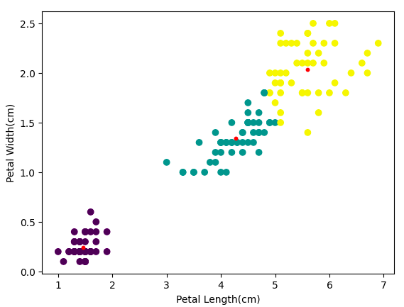

# Implementation of K-Means Algorithm

This project implements the K-Means clustering algorithm from scratch and applies it to the Iris dataset.

The algorithm uses the Euclidean norm to calculate the distance between data points and cluster centers. The initial cluster centers are selected randomly, and the algorithm updates the clusters iteratively until convergence.

## Clustering Result

The red points represent the cluster centers, while the other colors represent the data points assigned to each cluster.

In this experiment, K-Means was applied using only the **Petal Length** and **Petal Width** features. The result achieved a higher success rate compared to using all four features. This may be because K-Means is sensitive to noise and outliers, and the Sepal Length and Sepal Width features may reduce the quality of the clustering.

## Confusion Matrix

The confusion matrix below shows the clustering performance after mapping the predicted clusters to the correct Iris classes.

<table>
  <tr>
    <th>Actual / Predicted</th>
    <th>Iris-setosa</th>
    <th>Iris-versicolor</th>
    <th>Iris-virginica</th>
  </tr>
  <tr>
    <td>Iris-setosa</td>
    <td align="center">50</td>
    <td align="center">0</td>
    <td align="center">0</td>
  </tr>
  <tr>
    <td>Iris-versicolor</td>
    <td align="center">0</td>
    <td align="center">48</td>
    <td align="center">2</td>
  </tr>
  <tr>
    <td>Iris-virginica</td>
    <td align="center">0</td>
    <td align="center">4</td>
    <td align="center">46</td>
  </tr>
</table>

**Success Rate:** 96%

The model correctly grouped all Iris-setosa samples. It also performed well on Iris-versicolor and Iris-virginica, with only a small number of samples assigned to the wrong cluster.

## Main Features

- Implemented K-Means clustering using Euclidean distance
- Applied the algorithm to the Iris dataset
- Used random initialization for the cluster centers
- Mapped clustering results to the original dataset classes
- Evaluated the results using a confusion matrix and accuracy

